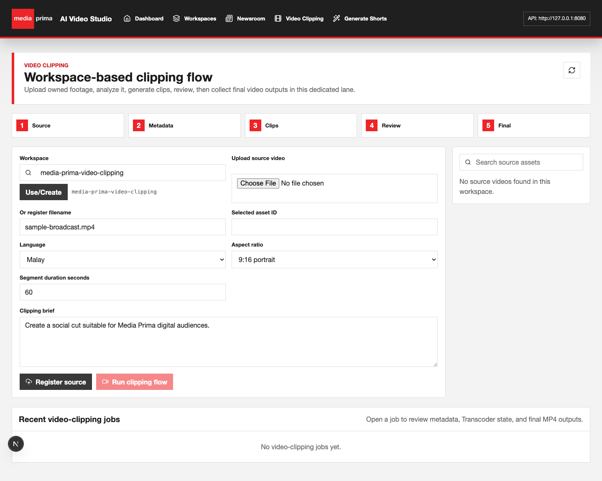
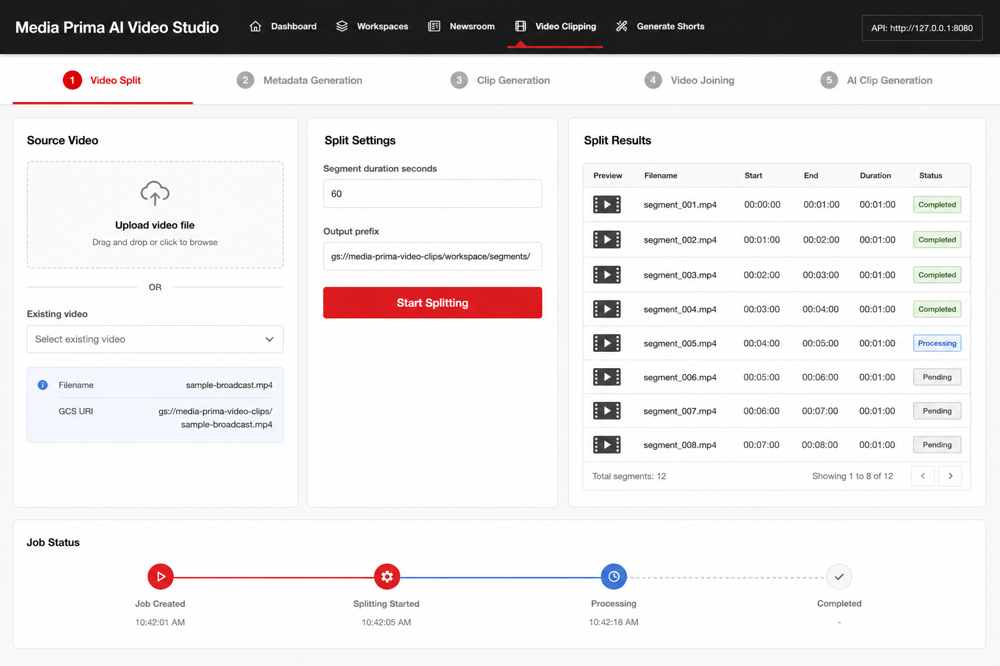
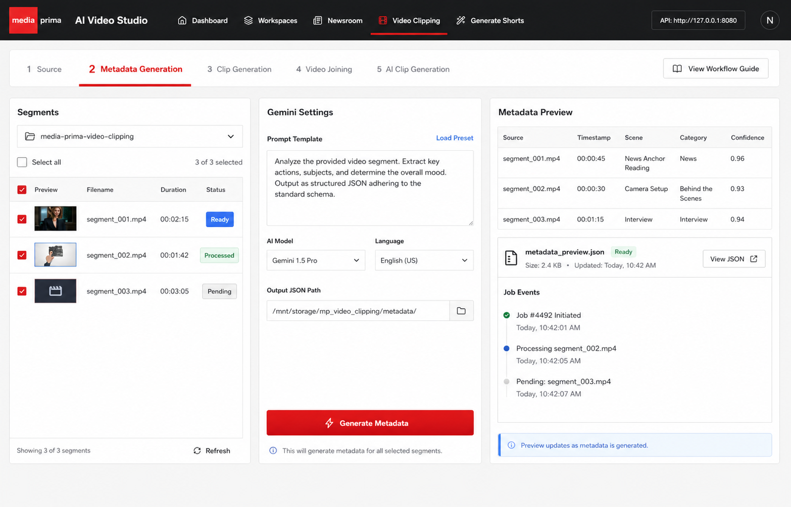
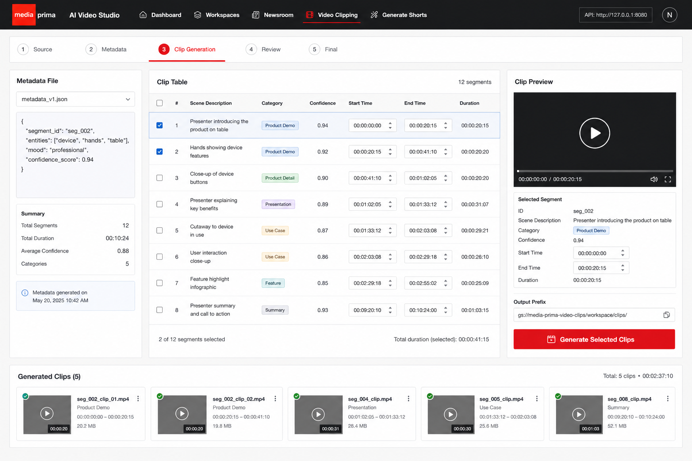
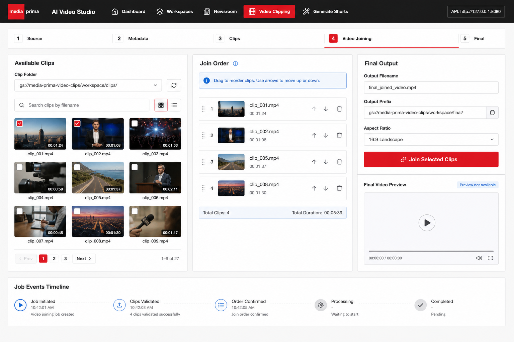
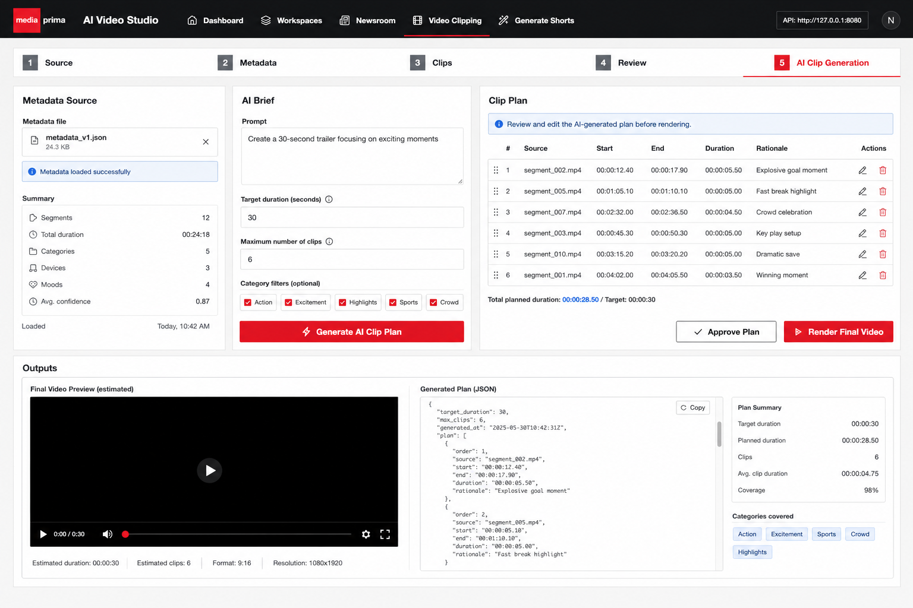
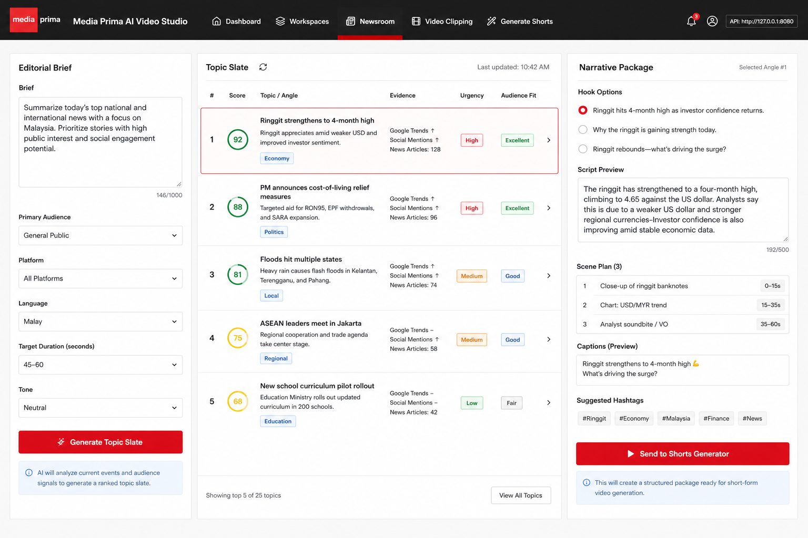
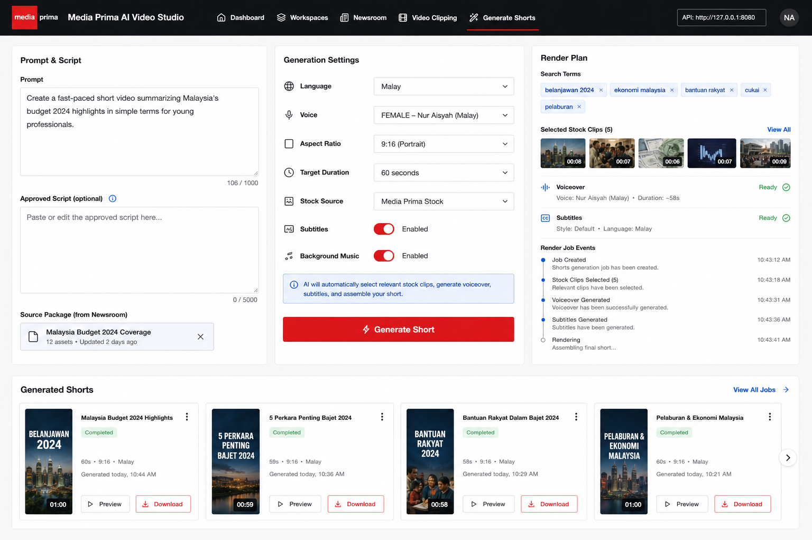

# Prima Studio Feature And Video Clipping Flow Spec

Date: 2026-06-24  
Status: Draft for review before implementation  
Scope: Product story, feature map, video clipping user flow, UI direction, and backend contract gaps.

## Executive Summary

The product name should remain **Prima Studio**. The earlier `ClipForge Studio` naming direction is dropped.

The main problem with the current video clipping implementation is still the same: it compresses the upstream `revmed-vid-clip` workflow into one generic form and one `/workflows/video-clipping` job. The upstream mental model is not "upload and run one opaque clipping flow"; it is a visible production pipeline:

1. Split a source video into segments.
2. Generate metadata from selected segments.
3. Manually create clips from reviewed metadata.
4. Join selected clips into a final video.
5. Optionally let AI propose a clip plan from metadata, then approve and render it.

This spec also expands the story beyond video clipping. Prima Studio should be understood as three connected production lanes:

- **Newsroom**: finds stories, angles, scripts, captions, and scene plans.
- **Video Clipping**: turns owned long-form footage into reviewable clips and final edits.
- **Shorts Generator**: turns prompts or approved newsroom packages into rendered social shorts.

## Final Open Decisions

These decisions replace the open questions from the prior draft.

| Decision | Recommendation |
| --- | --- |
| Product name | Keep **Prima Studio**. Do not rename the whole product to ClipForge or any upstream project name. |
| Video clipping lane name | Keep **Video Clipping** in nav and page titles. |
| Cast/face refinement | Drop it from the primary flow. Keep Tab 3 as manual Clip Generation. Revisit face/cast matching later only if we implement a better algorithm with reliable embeddings, reference management, confidence thresholds, and human confirmation. |
| Processing backend | Use **Google Cloud Transcoder only** for real split, clip, and join processing. Tests can mock jobs and use fixtures, but user-visible processing should not silently fall back to fake local MP4s. |
| Metadata output | Use one consolidated metadata JSON per run, with each row referencing its source segment URI and segment asset ID. This is simpler for editors and for AI Clip Generation. |
| AI Clip Generation output | Generate an editable AI clip plan first. After approval, render a final joined video by default, with an optional checkbox to also materialize individual clips. |

## Current Flow Problem

The current local page presents a five-step-looking stepper, but the steps are not actionable tabs. The single primary action, `Run clipping flow`, sends a source asset to metadata and render orchestration without giving the editor control over segments, metadata, clips, or join order.

## GPT Image UI Drafts

These GPT-image drafts are intentionally simple and page-level. They are not final UI specs; they set the desired information architecture, density, and action model.

### Video Split

### Metadata Generation

### Clip Generation

### Video Joining

### AI Clip Generation

### Newsroom

### Shorts Generator

## Product Story

Prima Studio is an internal production workspace for making social video assets from two kinds of inputs:

- **Owned editorial or entertainment footage**, handled by Video Clipping.
- **Editorial ideas or prompts**, handled by Newsroom and Shorts Generator.

The system should make every asset visible: source video, segments, metadata, clips, clip plans, final videos, scripts, captions, and rendered shorts. Editors should always know where an output came from and what action is recommended next.

### Story 1: Owned Footage To Manual Final Video

An editor uploads or selects a long-form video. They split it into equal-length segments, analyze selected segments with Gemini, inspect the metadata, choose exact moments, generate clip files, order the clips, and join them into a final video.

Flow:

`Source video -> Segments -> Metadata JSON -> Manual clips -> Ordered final video`

Best for:

- Drama trailers.
- Highlight reels.
- News package repurposing.
- Editor-controlled social cuts.

### Story 2: Owned Footage To AI-Assisted Trailer

An editor still starts with split and metadata, but instead of selecting every row manually, they ask AI for a plan: "create a 30-second trailer focusing on the exciting moments." The AI returns an editable timeline plan. The editor approves or edits it, then renders the final video.

Flow:

`Source video -> Segments -> Metadata JSON -> AI clip plan -> Approved final video`

Best for:

- Fast first drafts.
- Trailer concepts.
- Multiple cutdown variants.
- Prompt-driven experimentation while preserving metadata provenance.

### Story 3: Newsroom Brief To Approved Short

A producer enters a news or editorial brief. Newsroom generates a ranked topic slate, evidence notes, angles, hooks, script, scene plan, captions, hashtags, and search terms. After an editor selects a package, it is sent to Shorts Generator.

Flow:

`Editorial brief -> Topic slate -> Narrative package -> Shorts Generator handoff`

Best for:

- Daily editorial planning.
- Social-first explainers.
- News packages needing an approved narrative before render.

### Story 4: Prompt To Generated Short

A producer starts directly from a prompt. Shorts Generator builds or accepts a script, derives search terms, selects stock media, adds voice/subtitles/BGM, renders the video, and shows final outputs.

Flow:

`Prompt -> Script -> Search terms -> Media plan -> Voice/subtitles/BGM -> Rendered short`

Best for:

- Evergreen explainers.
- Campaign clips.
- Non-owned-footage social video.
- Fast ideation.

## Feature Map

### 1. Workspaces

Purpose: Keep assets, jobs, and outputs organized by production context.

Core requirements:

- Create/select workspace.
- Show workspace asset counts by type.
- Preserve recent jobs and outputs.
- Use predictable storage prefixes.

Recommended storage shape:

- `uploads/`
- `segments/`
- `metadata/`
- `clips/`
- `clip_plans/`
- `final/`
- `newsroom/`
- `shorts/`

### 2. Newsroom

Purpose: Turn editorial briefs into structured, reviewable story packages.

Inputs:

- Brief.
- Audience.
- Platform.
- Tone.
- Language.
- Target duration.

Outputs:

- Topic cards.
- Evidence signals.
- Angles.
- Hooks.
- Script.
- Scene plan.
- Captions.
- Hashtags.
- Search terms.
- Shorts Generator handoff package.

Primary action:

- `Generate Topic Slate`
- `Send to Shorts Generator`

Product behavior:

- Newsroom should not render video directly.
- It should produce editorial packages that can be approved, edited, and handed to Shorts Generator.
- Shorts Generator should preserve approved scripts and search terms from Newsroom instead of rewriting them from scratch.

### 3. Video Clipping

Purpose: Turn owned footage into metadata, clips, AI plans, and final videos.

Primary tabs:

- Video Split.
- Metadata Generation.
- Clip Generation.
- Video Joining.
- AI Clip Generation.

Product behavior:

- Each tab must expose input artifacts and output artifacts.
- Each tab must be independently runnable.
- Users must be able to recover from partial progress.
- No hidden final render should happen from metadata generation.

### 4. Shorts Generator

Purpose: Generate a rendered social short from a prompt or approved Newsroom package.

Inputs:

- Prompt.
- Optional approved script.
- Optional Newsroom handoff package.
- Language.
- Voice.
- Aspect ratio.
- Duration.
- Stock provider.
- Subtitle and BGM settings.

Outputs:

- Script JSON.
- Search terms.
- Media plan.
- Voice/subtitle assets.
- Rendered MP4.
- Output history.

Product behavior:

- Do not mention upstream implementation project names in user-facing UI.
- The lane can remain inspired by proven prompt-to-short workflows, but the product language should be Prima Studio's.
- When launched from Newsroom, preserve the approved editorial package.
- When launched directly, generate the script and media plan from the user's prompt.

### 5. Job Detail And Output Review

Purpose: Make async processing understandable.

Every job should show:

- Status.
- Stage-specific events.
- Input assets.
- Output assets.
- Error details.
- Download or preview actions.
- Next recommended action.

## Video Clipping Flow Spec

### Tab 1: Video Split

Goal: Upload or select a source video and split it into equal-length segments.

Primary controls:

- Workspace selector.
- Upload video file.
- Existing uploaded video selector.
- Segment duration in seconds.
- Output prefix, default `segments/`.
- `Start Splitting` action.

Main view:

- Source video card with filename, size, duration, GCS URI, and upload status.
- Segment preview table after split: filename, start/end, duration, status, signed preview URL.
- Job event timeline: queued, submitted, running, completed, failed.

Backend requirements:

- Add `POST /video-clipping/split`.
- Add `AgentTaskKind.split`.
- Add `StepName.split_requested` and `StepName.split_completed`.
- Add Transcoder split support that outputs one `AssetKind.segment` per segment.
- Store segment metadata: source asset ID, segment index, start/end seconds, duration.

Acceptance criteria:

- A user can upload/select one video and start split without entering a clipping prompt.
- Segments appear in the workspace as `segment` assets.
- Split can succeed without triggering metadata or render.

### Tab 2: Metadata Generation

Goal: Analyze selected segments with Gemini and produce structured JSON metadata.

Primary controls:

- Segment folder selector, default `<workspace>/segments/`.
- Segment multi-select with select all/deselect all.
- Prompt template.
- Gemini model selector.
- Language selector.
- Output metadata path, default `metadata/`.
- `Generate Metadata` action.

Main view:

- Segment table with thumbnail, filename, duration, status, and source.
- Metadata preview table after completion.
- JSON file card with download/open actions.
- Validation warnings for malformed or out-of-duration timestamps.

Metadata fields:

- `source_filename`
- `source_uri`
- `source_segment_asset_id`
- `timestamp_start_end`
- `brief_scene_description`
- `editor_note_clip_rationale`
- `key_dialogue_snippet`
- `dominant_emotional_tone_impact`
- `key_visual_elements_cinematography`
- `characters_in_focus_objective_emotion`
- `plot_relevance_significance`
- `trailer_potential_category`
- `pacing_suggestion_for_clip`
- `music_sound_cue_idea`
- `confidence_score`

Backend requirements:

- Add `POST /video-clipping/metadata`.
- Accept selected segment asset IDs.
- Generate one consolidated metadata asset per run.
- Validate timestamp ranges against known segment duration.

Acceptance criteria:

- Metadata generation can be rerun on any selected subset of segments.
- Output JSON is reviewable before clip generation.
- No clip or final MP4 is generated from this tab.

### Tab 3: Clip Generation

Goal: Manually create clips from segment metadata with editable timestamps.

Primary controls:

- Metadata file selector.
- Metadata row table.
- Inline start/end timestamp editors.
- Clip output prefix, default `clips/`.
- Optional clip label/category override.
- `Generate Selected Clips` action.

Main view:

- Metadata rows with source segment preview.
- Editable in/out fields with duration calculation.
- Bulk select by category, rank, emotion, or confidence.
- Generated clips grid with video preview, filename, duration, and source metadata row.

Cast refinement decision:

- Do not include cast/face refinement in this primary tab.
- If Media Prima needs cast-specific filtering later, add it as a separate reviewed capability with face embeddings, reference images, confidence thresholds, and human approval.
- The previous face-recognition approach is not accurate enough to deserve primary UX space.

Backend requirements:

- Add `POST /video-clipping/clips`.
- Create one `AssetKind.clip` per selected metadata row.
- Preserve source row ID and edited timestamps in job event metadata.
- Use Transcoder for actual clip extraction.

Acceptance criteria:

- A user can create clips without invoking AI selection.
- Invalid timestamp ranges are blocked before job start.
- Generated clips are stored and listed independently from final joined videos.

### Tab 4: Video Joining

Goal: Combine selected clips into a final video in a user-controlled order.

Primary controls:

- Clip folder selector, default `clips/`.
- Clip multi-select.
- Drag/reorder selected clips.
- Output filename.
- Output prefix, default `final/`.
- `Join Selected Clips` action.

Main view:

- Clip gallery with preview, duration, source category.
- Ordered timeline strip.
- Total duration indicator.
- Final output preview after completion.

Backend requirements:

- Add `POST /video-clipping/join`.
- Accept ordered clip asset IDs.
- Create `AssetKind.final_video`.
- Store timeline JSON as a metadata sidecar for reproducibility.
- Use Transcoder concat for the final render.

Acceptance criteria:

- The user can define and see clip order before joining.
- Final video output is separate from generated clip assets.
- Rejoining a different order creates a new final output without overwriting prior results.

### Tab 5: AI Clip Generation

Goal: Automatically generate a sequence of clips from a metadata file and high-level prompt.

Primary controls:

- Metadata file selector.
- Target duration.
- User prompt, for example: "Create a 30-second trailer focusing on exciting moments."
- Constraints: include/exclude categories, max clips, pacing, language, aspect ratio.
- `Generate AI Clip Plan` action.
- `Render Final Video` action after review.

Main view:

- AI-selected timeline plan with clip rows, rationale, start/end, duration, and source segment.
- Editable plan before render.
- Final output preview.
- Optional "also save individual clips" toggle.

Backend requirements:

- Add `POST /video-clipping/ai-plan` to produce a proposed timeline JSON from metadata.
- Add `POST /video-clipping/render-plan` to render the approved plan.
- Reuse Shorts Generator prompt interpretation only for timeline reasoning, not stock search.
- Use Transcoder for final rendering.

Acceptance criteria:

- AI output is reviewable and editable before rendering.
- The default output after approval is a final joined video.
- The user can optionally materialize individual clips.
- The AI path does not bypass metadata provenance.

## Source Review

### Upstream `revmed-vid-clip`

The upstream project has separate Streamlit pages and backend endpoints for each major stage:

- `frontend/pages/1_video_split.py` uploads/selects a source video, sets segment duration, and calls `POST /split-video/`.
- `frontend/pages/2_metadata_generation.py` lists segment files, lets users select segments, configures prompt/model/language, and calls `POST /generate-metadata/`.
- `frontend/pages/3_clips_generation.py` lists metadata files, previews metadata tables, and calls `POST /generate-clips/`.
- `frontend/pages/5_video_joining.py` lists generated clips, lets users select/order clips, and calls `POST /join-videos/`.
- `frontend/pages/4_refine_clips.py` adds optional cast/face refinement, but this should not be part of the first Media Prima primary flow.
- `frontend/pages/6_final_result.py` is an output gallery; in Prima Studio this should be folded into Tab 4 outputs and Job Detail.

Important behavior to preserve:

- Workspace folders map to real storage prefixes.
- Segment generation is visible.
- Metadata is generated from selected segments.
- Manual clip generation is metadata-driven and user-reviewable.
- Joining uses selected clip files in a user-controlled order.

### Current Local App

The local app currently has `apps/web/components/VideoClippingForm.tsx` as one mixed form:

- Upload or register a source asset.
- Set workspace, language, aspect ratio, segment duration, and prompt.
- Start `POST /workflows/video-clipping`.
- View recent jobs.

Backend orchestration currently does this for `video_clipping`:

- `services/orchestrator/app/main.py` queues `metadata`, not `split`.
- `services/agents/metadata/app/main.py` analyzes input source assets and immediately queues render.
- `services/agents/render/app/main.py` builds a final joined video from metadata, or creates a demo fallback MP4.
- `packages/python/mpstudio/transcoder.py` has concat/render support, but no first-class split job.

## Backend Contract Shape

Recommended API namespace:

- `POST /video-clipping/split`
- `POST /video-clipping/metadata`
- `POST /video-clipping/clips`
- `POST /video-clipping/join`
- `POST /video-clipping/ai-plan`
- `POST /video-clipping/render-plan`
- `GET /workspaces/{workspace_id}/assets?kind=source_video`
- `GET /workspaces/{workspace_id}/assets?kind=segment`
- `GET /workspaces/{workspace_id}/assets?kind=metadata`
- `GET /workspaces/{workspace_id}/assets?kind=clip`
- `GET /workspaces/{workspace_id}/assets?kind=final_video`

Recommended new or expanded asset kinds:

- `source_video`
- `segment`
- `metadata`
- `clip`
- `clip_plan`
- `final_video`
- `thumbnail`
- `newsroom_package`
- `short_script`
- `short_media_plan`
- `generated_short`

Recommended job event steps:

- `video_uploaded`
- `split_requested`
- `split_completed`
- `metadata_requested`
- `metadata_generated`
- `clip_generation_requested`
- `clips_generated`
- `join_requested`
- `final_video_generated`
- `ai_plan_requested`
- `ai_plan_generated`
- `render_plan_requested`
- `newsroom_requested`
- `newsroom_generated`
- `shortgen_requested`
- `shortgen_generated`
- `failed`

## UI Requirements

- The app must open into usable work surfaces, not marketing pages.
- Keep the product name as **Prima Studio**.
- Use compact production UI: small labels, dense tables, clear borders, limited red primary actions.
- Keep tabs real and navigable.
- Show input artifacts and output artifacts on every workflow page.
- Use video thumbnails where users choose video assets.
- Use JSON/table previews where users choose metadata assets.
- Use clear primary actions:
  - `Start Splitting`
  - `Generate Metadata`
  - `Generate Selected Clips`
  - `Join Selected Clips`
  - `Generate AI Clip Plan`
  - `Render Final Video`
  - `Generate Topic Slate`
  - `Send to Shorts Generator`
  - `Generate Short`
- Show next recommended action after every successful job.

## Implementation Sequence

1. Keep user-facing copy on Prima Studio and Shorts Generator language.
2. Add asset listing filters by kind to the API.
3. Add Transcoder split stage and segment asset persistence.
4. Split `VideoClippingForm` into real tabbed workflow components.
5. Implement Tab 1 and Tab 2 against real persisted assets.
6. Add metadata preview and timestamp validation.
7. Implement manual clip generation from selected metadata rows.
8. Implement clip joining with ordered selected clip IDs.
9. Implement AI clip plan generation as a reviewable plan, then render approved plans.
10. Update Newsroom and Shorts story/copy so users understand how those lanes connect.

## Non-Goals For This Pass

- No source-code implementation yet.
- No face/cast refinement in the primary flow.
- No broad visual redesign beyond the attached page-level UI direction.
- No copying unlicensed upstream source code verbatim. The implementation should remain clean-room unless a license is added or permission is granted.

## References

- Upstream repo: <https://github.com/plc1220/revmed-vid-clip>
- Current local UI: `apps/web/components/VideoClippingForm.tsx`
- Current local API: `services/api/app/main.py`
- Current local orchestration: `services/orchestrator/app/main.py`
- Current local metadata agent: `services/agents/metadata/app/main.py`
- Current local render agent: `services/agents/render/app/main.py`
- Current local shared contracts: `packages/python/mpstudio/contracts.py`
- Current local transcoder helper: `packages/python/mpstudio/transcoder.py`
